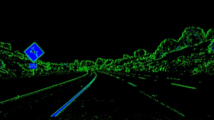
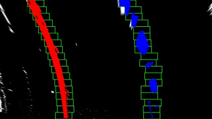

## Writeup / README

---

**Advanced Lane Finding Project**

The goals / steps of this project are the following:

* Compute the camera calibration matrix and distortion coefficients given a set of chessboard images.
* Apply a distortion correction to raw images.
* Use color transforms, gradients, etc., to create a thresholded binary image.
* Apply a perspective transform to rectify binary image ("birds-eye view").
* Detect lane pixels and fit to find the lane boundary.
* Determine the curvature of the lane and vehicle position with respect to center.
* Warp the detected lane boundaries back onto the original image.
* Output visual display of the lane boundaries and numerical estimation of lane curvature and vehicle position.

---

## Writeup / README

### Camera Calibration

#### 1. Briefly state how you computed the camera matrix and distortion coefficients. Provide an example of a distortion corrected calibration image.

The code for this step is contained in the second code cell of the IPython notebook located in "./LaneFinder.ipynb". 

I start by preparing "object points", which will be the (x, y, z) coordinates of the chessboard corners in the world. Here I am assuming the chessboard is fixed on the (x, y) plane at z=0, such that the object points are the same for each calibration image.  Thus, `objp` is just a replicated array of coordinates, and `objpoints` will be appended with a copy of it every time I successfully detect all chessboard corners in a test image.  `imgpoints` will be appended with the (x, y) pixel position of each of the corners in the image plane with each successful chessboard detection. I visually inspected the calibration to ensure the chessboard was fitted appropriately, an example follows:

I then used the output `objpoints` and `imgpoints` to compute the camera calibration and distortion coefficients using the `cv2.calibrateCamera()` function.  I applied this distortion correction to the test image using the `cv2.undistort()` function and obtained this result: 

Original Image| Undistorted Image
- | - 
 | 

### Pipeline (single images)

#### 1. Example of a distortion-corrected image.

To correct an image for distoriton in the image processing pipeline we run the `dist_correct` function, which takes in an image as well as the `objpoints` and `imgpoints` from the calibration step to correct the raw image. An example of this distortion correction can be seen in the images below: 

Original Image| Undistorted Image
- | - 
 | 

#### 2. Description of thresholded binary image method. 

I used a combination of color and gradient thresholds to generate a binary image. I converted an image to HLS color space using the `cv2.cvtColor()` function and seperated the lightness channel. I took the derivative in the x direction using `cv2.sobel()` function and and took the absolute value of that derivative to accentuate the lines away from the horizontal. The x gradient was then thresholded based on tuned values. THe color channel was also thresholded based on tuned values. After that tuning occured the binary channels were stacked to visualize the effect of each piece of the image pipeline. In the image processing pipeline the binary channels were added together to include the effects of the gradient and color threshold.

Here's an example of my output for this step from one of the test images. 

Original Image | Threshold Color Binary | Binary Output
- | - | -
 |  | 

#### 3. Description of perspective transform method.

The code for my perspective transform can be found in the `transform` cell. For this code I identified four source points for the perspective transform. In this case, I assumed the road is a flat plane. This isn't strictly true, but it can serve as an approximation for this project. Four points were picked in a trapezoidal shape (similar to region masking) that would represent a rectangle when looking down on the road from above.

The easiest way to do this is to investigate an image where the lane lines are straight, and find four points lying along the lines that, after perspective transform, I made the lines look straight and vertical from a bird's eye view perspective.

One interesting aspect to perspective warping for tuning paramters is the use of a UI to tune the output destination, since manually fitting the trapezoid is straightforward, the destination points can be tuned properly using two sliders that change their initial x and final x positions (y will be constant because the lines need to be parallel). 

Those same four source points will now work to transform any image (again, under the assumption that the road is flat and the camera perspective hasn't changed). When applying the transform to new images, the test of whether or not you got the transform correct, is that the lane lines should appear parallel in the warped images, whether they are straight or curved.

Results from interactive GUI:

    * src = `np.array([[200,img.shape[0]],[600,450],[690,450],[1110,img.shape[0]]], np.int32)`
    * lower = 340
    * upper = 900
    * dst = `np.float32([[lower,img_size[1]],[lower,0],[upper,0],[upper,img_size[1]]])`

I verified that my perspective transform was working as expected by drawing the `src` and `dst` points onto a test image and its warped counterpart to verify that the lines appear parallel in the warped image. The following image shows how the UI was used to tune the parameters and result on a a test image with straight lines.

#### 4.a Lane finding method - sliding windows

After applying calibration, thresholding, and a perspective transform to a road image, I have a binary image where the lane lines stand out clearly. I still need to decide explicitly which pixels are part of the lines and which belong to the left line and which belong to the right line.

Plotting a histogram of where the binary activations occur across the image is one solution for this. Tests were run to prove that a histogram is a viable solution for finding the lanes. A histogram from a sample image shows to identifiable local maximums at the approximate x intercepts for the lane: 

Next step is to implement sliding windows to fit a polynomial which estimates the lane lines

Split the histogram for the two lines

 * The first step we'll take is to split the histogram into two sides, one for each lane line

Set up windows and window hyperparameters

 * Our next step is to set a few hyperparameters related to our sliding windows, and set them up to iterate across the binary activations in the image. 

Iterate through nwindows to track curvature

 * Now that I've set up what the windows look like and have a starting point, we'll want to loop for nwindows, with the given window sliding left or right if it finds the mean position of activated pixels within the window to have shifted.
 
1. Loop through each window in nwindows
2. Find the boundaries of our current window. This is based on a combination of the current window's starting point (leftx_current and rightx_current), as well as the margin you set in the hyperparameters.
3. Use cv2.rectangle to draw these window boundaries onto our visualization image out_img. This is required for the quiz, but you can skip this step in practice if you don't need to visualize where the windows are.
4. Now that we know the boundaries of our window, find out which activated pixels from nonzeroy and nonzerox above actually fall into the window.
5. Append these to our lists left_lane_inds and right_lane_inds.
6. If the number of pixels you found in Step 4 are greater than your hyperparameter minpix, re-center our window (i.e. leftx_current or rightx_current) based on the mean position of these pixels.

Fit a polynomial

 * Now that I have found all our pixels belonging to each line through the sliding window method, it's time to fit a polynomial to the line.
 
The following image shows the warped threshold binary image and then the results of the sliding window approach on that image to identify the lane lines. The sliding window method can be found in the `fit_polynomial()` function, which takes in a binary warped image and outputs the left and right lane fitted polynomials. 

Warped Threshold Image| Sliding Windows
- | - 
 | 

#### 4.b Lane finding Method - search from prior

I built an algorithm that uses sliding windows to track the lane lines out into the distance. However, using the full algorithm from before and starting fresh on every frame may seem inefficient, as the lane lines don't necessarily move a lot from frame to frame.

In the next frame of video I don't need to do a blind search again, but instead I can just search in a margin around the previous lane line position, like in the above image. The green shaded area shows where I searched for the lines this time. So, once I know where the lines are in one frame of video, I can do a highly targeted search for them in the next frame.

This is equivalent to using a customized region of interest for each frame of video, and should help me track the lanes through sharp curves and tricky conditions. If I lose track of the lines, go back to my sliding windows search or other method to rediscover them. This method was implemented in the function `search_around_poly()` which takes in the binary warped image as well as the previous 2D polynomial fit for the left and right lanes as well as a margin, which is the width around the previous polynomail to search. The following images show a result of this function for a sample image. 

Warped Threshold Image| Serach From Prior
- | - 
 | 

#### 5. Calculating the radius of curvature of the lane and the position of the vehicle with respect to center.

I followed the following equations to find the radius of curvature of a polynomial.

Note that these equations will output the radius of curvature of the 2D polynomail in pixel space. The function `measure_curvature_real()` was used to convert the radius in a measurable space (meters). 

To repeat this calculation after converting our x and y values to real world space involves measuring how long and wide the section of lane is that I have projected in the warped image. I could do this in detail by measuring out the physical lane in the field of view of the camera, but for this project, I will assume that if I am projecting a section of lane similar to the images above, the lane is about 30 meters long and 3.7 meters wide. Or, if you prefer to derive a conversion from pixel space to world space in your own images, compare your images with U.S. regulations that require a minimum lane width of 12 feet or 3.7 meters, and the dashed lane lines are 10 feet or 3 meters long each.

Let's say that our camera image has 720 relevant pixels in the y-dimension (remember, our image is perspective-transformed!), and we'll say roughly 600 relevant pixels in the x-dimension. Therefore, to convert from pixels to real-world meter measurements, we can use:

Define conversions in x and y from pixels space to meters

    * ym_per_pix = 30/720 # meters per pixel in y dimension
    * xm_per_pix = 3.7/600 # meters per pixel in x dimension
    
This conversion and the above equations allow me to calculate the radius of curvature in meters of the lane. I can average this between the left and right lane polynomials. 

To find the distance of the vehicle with respect to the center, I took the x intercept of the left and right polynomials and subtracted that from the car_position - which was asssumed as the center of the frame (camera mounted at center of car assumption). I converted that to meters by multiplying by `xm_per_pix` to find the distance the car is located from the center of the frame. 

#### 6. Example of image of result plotted back down onto the road such that the lane area is identified clearly.

Once I had a good measurement of the line positions in warped space, it's time to project my measurement back down onto the road! Let's suppose, I have a warped binary image called warped, and I have fit the lines with a polynomial and have arrays called ploty, left_fitx and right_fitx, which represent the x and y pixel values of the lines. I can then project those lines onto the original image and draw the current stats on the image using the `draw_stats()` function. The following image shows 

---

### Pipeline (video)

#### 1. Link to final video output.  

Here's a [link to my video result](./test_videos_output/project_video.mp4)

---

### Discussion

#### 1. Briefly discuss any problems / issues you faced in your implementation of this project.  Where will your pipeline likely fail?  What could you do to make it more robust?

The approach I took included the following steps:

1. Calibrating the camera
2. Correcting the image distortion - returns undistorted image after inputting the calibration points
3. Combining a color transform to HLS and gradient thresholding to create a thresholded binary image
4. Applying a perspective transform to rectify binary image ("birds-eye view")
5. After the image is warped into the new frame then if the left_line and right_line were detected in the last frame then use the look-ahead-filter (search from prior algorithm), otherwise use the slliding window approach to find the lane lines
6. Invalidate the fit if x intercept for either line is > 40 pixels from the previous intercept
7. Use the previous fit if the center dist is greater than .5m and invalidate the fit
8. Determine radius of curvature, distance from center, warp back into image frame and visualize the output
    
The approach of using the lightness color threshold combined with the sobel x operator worked well to identify the lines. The other pipeline approach that worked well was using the look ahead filter, which would also help with performance concerns in a realtime system. More smoothing could be implemented, which would help with jittery line movement, which can be seen during some frames. This pipeline might fail when the line lanes are not visible for a large period of time or when there are rapid shifts in lane lines - such as merging from a 2 lane road to a 1 lane road. This algorithm could be improved with more smoothing to take an average over n past measurements to obtain the lane position to draw onto the image. A state manager could be implemented to take into account complicated scenes - like merging - with an alternate method where the pipeline is designed to detect rapid shifts in lane movement. 